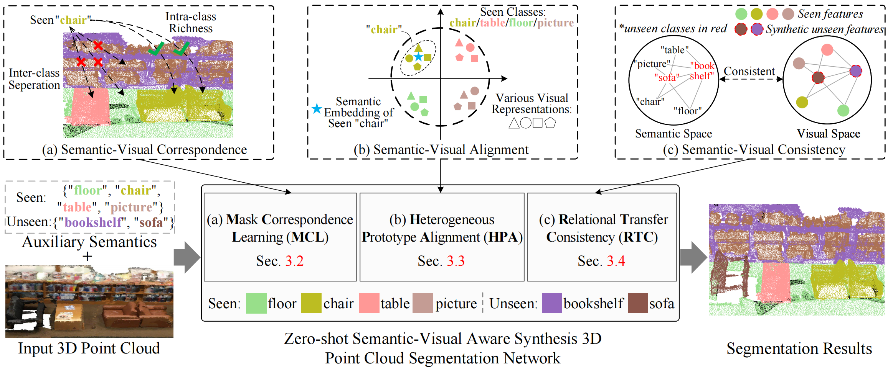
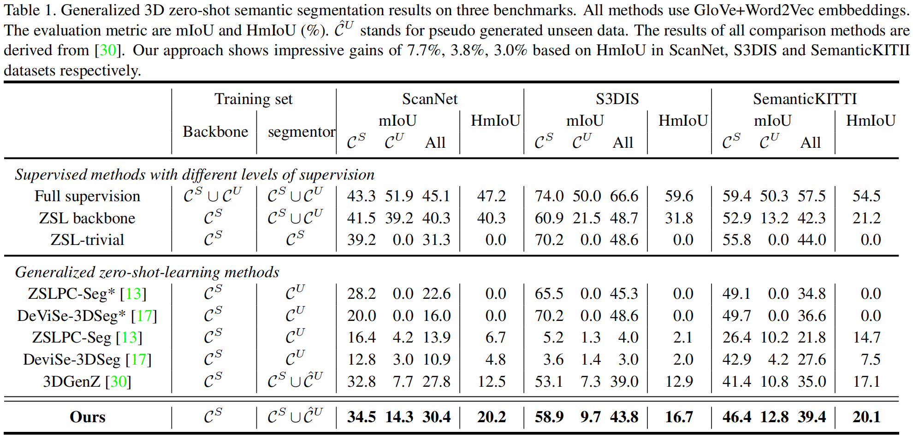
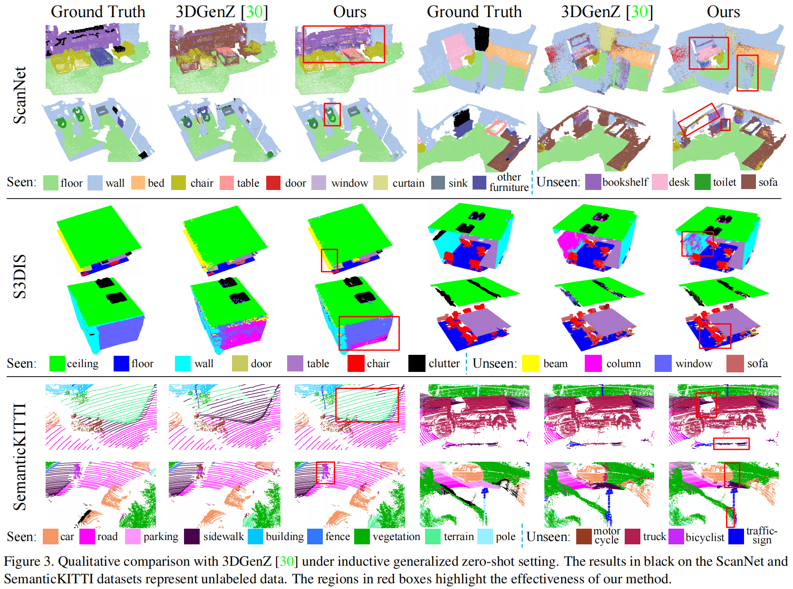

# Zero-Shot Point Cloud Segmentation by Semantic-Visual Aware Synthesis
This is the code repository related to "[Zero-Shot Point Cloud Segmentation by Semantic-Visual Aware Synthesis](https://openaccess.thecvf.com/content/ICCV2023/html/Yang_Zero-Shot_Point_Cloud_Segmentation_by_Semantic-Visual_Aware_Synthesis_ICCV_2023_paper.html)" (ICCV 2023, Poster) in PyTorch implementation.



## 1. Abstract
This paper proposes a feature synthesis approach for zero-shot semantic segmentation of 3D point clouds, enabling generalization to previously unseen categories. Given only the class-level semantic information for unseen objects, we strive to enhance the correspondence, alignment and consistency between the visual and semantic spaces, to synthesise diverse, generic and transferable visual features. We develop a masked learning strategy to promote diversity within the same class visual features and enhance the separation between different classes. We further cast the visual features into a prototypical space to model their distribution for alignment with the corresponding semantic space. Finally, we develop a consistency regularizer to preserve the semantic-visual relationships between the real seen features and synthetic-unseen features. Our approach shows considerable semantic segmentation gains on ScanNet, S3DIS and SemanticKITTI benchmarks.

## 2. Setup
This code is tested with Python 3.7, Pytorch 1.8.0 and CUDA 11.1, you can follow these steps:
   ```
    conda create -n 3DPC-GZSL python=3.7
    conda activate 3DPC-GZSL
    pip install torch==1.8.0+cu111 torchvision==0.9.0+cu111 -f https://download.pytorch.org/whl/torch_stable.html
    pip install -r requirements.txt
   ```
   
## 3. Usage
### Installation
1. Download and build the backbones: [FKAConv](https://github.com/valeoai/FKAConv) for ScanNet, [ConvPoint](https://github.com/aboulch/ConvPoint) for S3DIS, [KPConv](https://github.com/HuguesTHOMAS/KPConv-PyTorch) for SemanticKITTI (Original codes have already been included in this repository), follow the below instructions to build:
- For Convpoint:
   ```
    cd ./3DGZSL/gzsl3d/convpoint/convpoint/knn
    python3 setup.py install --home="."
   ```
Then, cut the file 'nearest_neighbors.cpython-xxx.so' and 'nearest_neighbors.py' from the path 'convpoint/convpoint/knn/lib/python/KNN_NanoFLANN-xxx.egg' and paste to the path 'convpoint/convpoint/knn/lib/python'.

- For FKAConv: (Build the Convpoint firstly)
   ```
    cd ./3DGZSL/gzsl3d/fkaconv
    pip install -ve .
   ```

- For KPConv:
   ```
    cd ./3DGZSL/gzsl3d/kpconv/cpp_wrappers
    bash ./compile_wrappers.sh
   ```

2. Download the datasets: [ScanNet](http://www.scan-net.org/), [S3IDS](http://buildingparser.stanford.edu/dataset.html) (Download the Stanford3dDataset_v1.2_Aligned_Version) and [SemanticKITTI](http://semantic-kitti.org/dataset.html#download), and put them into the following folder (The descriptions of the dataset format are available in the corresponding folder):
   ```
    ~/3DGZSL
    ~/data/scannet
    ~/data/s3dis
    ~/data/semantic_kitti
    ```
- For ScanNet dataset, it is recommended that you can directly download the processed data in this [link1](https://shapenet.cs.stanford.edu/media/scannet_data_pointnet2.zip) and put it in the '~/data/scannet/', or for preprocessing in this [link2](https://github.com/charlesq34/pointnet2/tree/master/scannet).

- For S3DIS dataset, you can run the following command to preprocess the data (see README.md in '~/data/s3dis'):
  ```
    python ./3DGZSL/gzsl3d/convpoint/examples/s3dis/prepare_s3dis_label.py --folder './3DGZSL/data/s3dis/Stanford3dDataset_v1.2_Aligned_Version' --dest './3DGZSL/data/s3dis/processed_data'
  ```
  The processed data can be generated in the '~/data/s3dis/processed_data'.

- For SemanticKIITI dataset, you only need to reformat the folder structure (see README.md in '~/data/semantic_kitti'). Besides, You also need to download the files [semantic-kitti-all.yaml](https://github.com/PRBonn/semantic-kitti-api/blob/master/config/semantic-kitti-all.yaml) and [semantic-kitti.yaml](https://github.com/PRBonn/semantic-kitti-api/blob/master/config/semantic-kitti.yaml), put them in the path ~/data/semantic_kitti.

3. Download the [semantic word embeddings](https://drive.google.com/drive/folders/1FnZjpFeD_5fB0xyyxut7zktB3MSNVbVq?usp=sharing) (Already included in the uploaded folder):
   - Put the **semantic word embeddings** in:
    ```
    ~/3DGZSL/gzsl3d/word_representations
    ```
4. Download the [pretrained backbones](https://drive.google.com/drive/folders/1FnZjpFeD_5fB0xyyxut7zktB3MSNVbVq?usp=sharing), follow the path below to place:
   - For ScanNet, decompress the corresponding .zip file and put the files (including the checkpoint.pth, config.yaml and logs.txt file) in:
    ```
    ~/3DGZSL/gzsl3d/fkaconv/examples/scannet/FKAConv_scannet_ZSL4
    ```
   
   - For S3DIS, decompress the corresponding .zip file and put the file (including the state_dict.pth) in: 
    ```
    ~/3DGZSL/gzsl3d/convpoint/examples/s3dis/ConvPoint_s3dis_ZSL4
    ```
    
   - For SemanticKITTI, decompress the corresponding .zip file and put the files (including the Log_SemanticKITTI/checkpoints/xxx.tar and Log_SemanticKITTI/parameters.txt) in:
    ```
    ~/3DGZSL/gzsl3d/kpconv/results
    ```
5. Installation of the 3DGZSL package:
    ```
    cd ./3DGZSL
    sh install_gzsl3d.sh
    ```
### Training and Evaluation
1. For training a generalized zero-shot semantic segmentation model on various datasets (start from the original directory), you can follow the below instructions:
   - For ScanNet, run this command:
   ```
    cd ./3DGZSL/gzsl3d/seg/scripts_sn
    bash ./retrain_sn_weight50.sh
    ```
   
   - For S3DIS, run this command:
   ```
    cd ./3DGZSL/gzsl3d/seg/scripts_s3dis
    bash ./retrain_s3dis_weight50.sh
    ```
  
   - For SemanticKIITI, run this command:
   ```
    cd ./3DGZSL/gzsl3d/seg/scripts_sk
    bash ./retrain_sk_weight50.sh
    ```

2. For evaluation, you can follow the below instructions: (you can modified the model path in ".sh" file to implement the evaluation)
   - For ScanNet, run this command:
   ```
    cd ./3DGZSL/gzsl3d/fkaconv/examples/scannet/scripts_final_eval
    bash ./final_eval_retrained.sh
    ```
   
   - For S3DIS, run this command:
   ```
    cd ./3DGZSL/gzsl3d/convpoint/examples/s3dis/scripts_final_eval
    bash ./final_eval_retrained.sh
    ``` 
   
   - For SemanticKITTI, run this command:
   ```
    cd ./3DGZSL/gzsl3d/kpconv/scripts_final_eval/W50
    python ./test_zsl_models_bias0.2_retrained.py
    ``` 
    
We also provide the our pretrained model on three datasets in this [link](https://drive.google.com/drive/folders/1FnZjpFeD_5fB0xyyxut7zktB3MSNVbVq?usp=sharing), you can download the trained model (".pth.tar" format) and directly test for results (after modifying the path and model name). 
   

## 4. Results
### Quantitative Comparison
<p align='center'>
  
</p>

### Qualitative Comparsion
<p align='center'>
  
</p>
   
## 5. Citation
If it is helpful to your research, please cite our paper as follows:

    @inproceedings{yang2023zero,
         title={Zero-Shot Point Cloud Segmentation by Semantic-Visual Aware Synthesis},
         author={Yang, Yuwei and Hayat, Munawar and Jin, Zhao and Zhu, Hongyuan and Lei, Yinjie},
         booktitle={Proceedings of the IEEE/CVF International Conference on Computer Vision (ICCV)},
         pages={11586--11596},
         year={2023}
     }

## 6. Acknowledgement
We would like to sincerely thank [3DGenZ](https://github.com/valeoai/3DGenZ) for providing the base code and pre-trained backbone models, and thank [FKAConv](https://github.com/valeoai/FKAConv), [ConvPoint](https://github.com/aboulch/ConvPoint) and [KPConv](https://github.com/HuguesTHOMAS/KPConv-PyTorch) for their backbone codebase.

## 7. License
This repository is released under Apache-2.0 License (See LICENSE file for details), the backbone FKAConv, Convpoint and Base Framework Code are respectively taken from [FKAConv](https://github.com/valeoai/FKAConv), [ConvPoint](https://github.com/aboulch/ConvPoint) and [3DGenZ](https://github.com/valeoai/3DGenZ) (Only for research, See their LICENSE included in this repository for details), the backbone KPConv (3DGZSL/gzsl3d/kpconv) and 3DGZSL/gzsl3d/seg/utils are under the MIT Licence (See the corresponding LICENSE file for details). 
